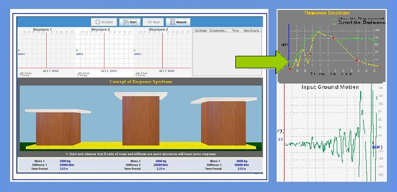
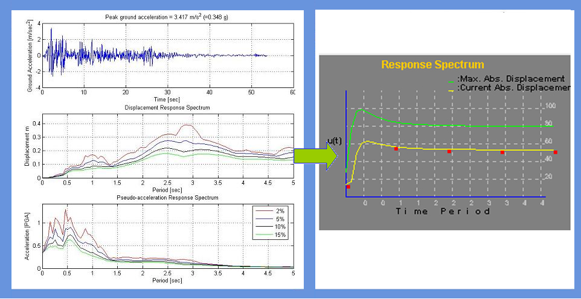

Response spectrum is one of the useful tools of earthquake engineering for analyzing the performance of structures especially in earthquakes, since many systems behave as single degree of freedom systems. Thus, if you can find out the natural frequency of the structure, then the peak response of the building can be estimated by reading the value from the ground response spectrum for the appropriate frequency. In most building codes in seismic regions, this value forms the basis for calculating the forces that a structure must be designed to resist (seismic analysis).

A response spectrum is a plot of the maximum response amplitude (displacement, velocity or acceleration) versus time period of many linear single degree of freedom oscillators to a give component of ground motion. The resulting plot can be used to select the response of any linear SDOF oscillator, given its natural frequency of oscillation. One such use is in assessing the peak response of buildings to earthquakes.

 
 

To understand the concept of response spectrum and to construct the same for a given component of ground motion.

 
