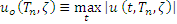
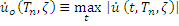
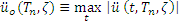

A plot of the peak value of a response quantity as a function of the natural vibration period of the system, or a related parameter such as circular frequency or cyclic frequency is called the response spectrum for that quantity.

A variety of response spectra can be defined depending on the response quantity that is plotted. Consider the following peak responses:

 

 

 

 

 

 

[Read More](doc/5.Theory.pdf)
